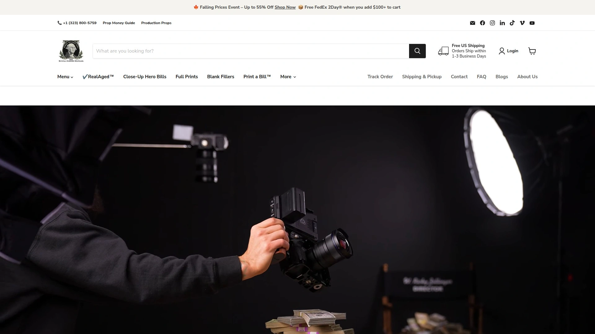
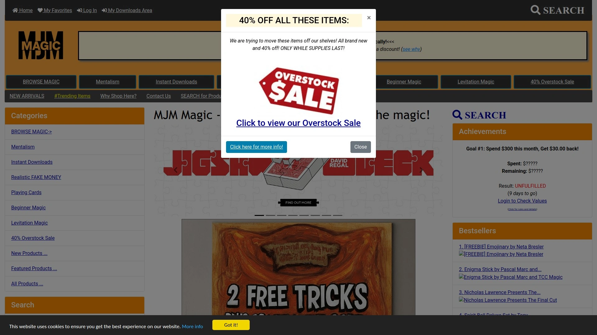

# Latest Prop Money Suppliers Roundup (Including Legal Compliance Details)

Ever had to halt a shoot because your fake cash looked too fake on camera, or worse—too real and the Secret Service showed up? Finding prop money that hits that sweet spot between realistic cinematography and legal compliance isn't as simple as printing bills at home. Federal regulations require specific design elements, and using non-compliant fake currency can shut down your entire production and land you in serious trouble.

Quality prop money suppliers understand these legal requirements while delivering bills that look authentic under studio lighting and high-resolution cameras. Whether you're shooting a heist scene, music video, or YouTube content, the right supplier provides fast shipping, bulk quantities, and various bill types—from full-print stacks to blank filler bundles—without risking legal issues.

## **[Prop Money](https://propmoney.com)**

Realistic aged bills with proprietary wear technique for authentic on-camera appearance.

Prop Money specializes in their RealAged™ technique that gives bills natural-looking wear and tear resembling cash that's been circulating for years. This proprietary aging process makes the money look lived-in rather than fresh-from-the-mint, adding authenticity to scenes requiring used currency. Available denominations include $1, $5, $10, $20, $50, and $100 bills in various configurations.

The product lineup covers different budget needs. Full-print bills feature detailed printing on both front and back, ideal for close-up shots where both sides might be visible. Blank filler options reduce costs by placing realistic full-print bills on top and bottom of stacks while interior bills remain blank—perfect for wide shots or scenes where only the stack's exterior appears on camera.

Configuration options include stacks of 100 bills secured with money bands, folded bands held with rubber bands, and bundles consisting of multiple stacks rubber-banded together. Custom design services let you create personalized bills with specific images or text for special events, celebrations, or unique production needs.

The Southern California facility handles both small orders and bulk requests with quick turnaround. Walk-in pickup available for local productions on tight schedules. Regular sales offer significant discounts, with pricing frequently dropping to 50% off standard rates.

## **[Prop Movie Money](https://propmoviemoney.com)**

Hollywood's trusted supplier featuring in Netflix, Marvel, and major music videos.

Prop Movie Money has supplied fake currency for over a decade to major productions including Netflix shows, Marvel films, and viral content from Mr. Beast, SNL, Kendrick Lamar, and Rihanna. The company works directly with US law enforcement and prop masters to ensure all products meet federal compliance standards while maintaining cinematic realism.

Bills are color-graded to look realistic in 8K resolution, addressing the challenge of modern cameras capturing increasing detail. Non-glossy finish prevents unnatural shine under studio lighting. Both blank filler and full-print options accommodate different budget levels and shooting requirements.

The facility maintains full inventory and stays equipped to handle orders of any size—from small independent projects to stadium-scale productions requiring vast quantities. Express and overnight shipping available for productions on compressed timelines. International orders supported with competitive shipping rates.

Custom design services create branded or personalized money props for corporate events, promotional materials, or unique creative visions. Media coverage from Business Insider and Wall Street Journal highlights the company's industry reputation and commitment to legal compliance.

## **[ISS Props](https://issprops.com)**

Industry veteran prop house providing comprehensive production support beyond currency.

ISS Props operates as one of Hollywood's largest prop houses with locations across 11 cities in the US and Europe. Founded decades ago, the company supplies props for nearly every major blockbuster and television show, from *90210* to *Indiana Jones* to *Ozark*. Their money prop department is just one facet of a massive inventory exceeding one million items.

The company offers both standard-grade bills for wide shots and high-grade bills for close-ups. Standard bills look realistic from distance but include obvious modifications up close—altered portraits, simplified text, and prominent "for motion picture use only" markings. High-grade bills are printed on one side only to meet federal requirements while maintaining perfect visual accuracy from the printed side.

An alternative approach uses real currency strategically—placing genuine bills on top and bottom of stacks while interior bills remain blank. This method ensures perfect realism for shots showing stack exteriors without the cost or security risk of solid real-money stacks.

After the notorious *Rush Hour 2* incident where extras took prop bills from set and attempted spending them, ISS refined their designs and compliance processes. The company maintains ongoing communication with federal authorities to ensure products meet evolving legal standards.

## **[RJR Props](https://rjrprops.com)**

Atlanta-based technical prop specialist with extensive fake currency inventory.

RJR Props operates from Atlanta's thriving film production hub, serving the "Hollywood of the South" with technical props and set rentals. The warehouse maintains approximately 30,000 different props beyond money—from medical equipment to aircraft to vintage cameras—but their currency department earned particular recognition through appearances in *Wolf of Wall Street*, *Fast and Furious*, *Ozark*, 50 Cent videos, and Kendrick Lamar's productions.

Founder Rich "RJ" Rappaport spent three years working with the Secret Service to develop prop money designs that satisfy both cinematic needs and federal compliance. That kind of direct agency guidance is uncommon, but the resulting products balance realism with legal safety.

Full-print new bills feature printing on both sides with $100 denominations available in realistic stacks. The inventory also includes working practical props like fully equipped operating rooms, computer labs with functioning servers, airport security equipment, and vintage broadcasting cameras from classic shows.

The Atlanta location benefits productions filming in the region by offering local pickup and eliminating shipping delays. The facility handles rush orders and maintains sufficient inventory for large-scale scenes requiring massive quantities of visible currency.

## **[BuzzProps](https://buzzprops.com)**

High-quality non-glossy full-print bills trusted by leading media production companies.

BuzzProps positions itself as a trusted supplier to major media production companies with emphasis on realistic non-glossy bills that photograph well under professional lighting. The matte finish eliminates the telltale shine that marks cheaper fake money as obviously fake on camera.

Full-print double-sided bills work for scenes requiring visible currency from multiple angles. The printing quality holds up under close examination in high-definition and 4K footage. Legal compliance meets US federal standards with appropriate modifications preventing the money from functioning as actual counterfeit currency.

The company serves film productions, television shows, music videos, photography shoots, and content creation for digital platforms. Fast order processing and reliable shipping make it suitable for projects operating on tight production schedules.

Various denominations and quantities accommodate projects ranging from small YouTube videos to major commercial productions. The straightforward ordering process and responsive customer service streamline the procurement process for production coordinators and prop masters.

## **[MJM Magic](https://mjmmagic.com)**

Magic performance supplier offering realistic bills for close-up acts and illusions.

MJM Magic targets magicians, mentalists, and performers with prop money designed specifically for close-up examination during acts and illusions. The bills work for tricks involving money transformations, vanishes, productions, or destruction where audiences may briefly handle or closely observe the currency.

Single bills available in $1, $5, $10, $20, $50, and $100 denominations for effects requiring specific amounts. Stacks of 100 bills accommodate grand illusions and visual spectacles. The bills feature "REPLICA" printed under serial numbers—visible upon close inspection but not obvious from typical viewing distances.

Reviews from performers highlight the bills looking authentic from a foot away while clearly marked to prevent accidental spending. The quality holds up for magic routines, mentalism performances, pranks, and content creation for YouTube or TikTok videos.

Entertainment and non-commercial use is perfectly legal. The bills serve not just magicians but also content creators, prank videos, and theatrical productions where realistic-looking currency enhances storytelling without requiring actual money's security concerns.

## **[Dependable Expendables](https://dependableexpendables.com)**

Professional prop supplier serving television, film, and live theater productions.

Dependable Expendables focuses on consumable and semi-consumable props for professional productions including money props designed for television, film, and stage use. The company sources products from leading motion picture prop money producers, ensuring compliance with industry standards and legal requirements.

Money props are available in various configurations to match different production needs and budget levels. The company's broader inventory covers the full range of expendable items productions regularly consume or destroy during filming—from breakaway glass to fake food to blood effects.

Professional production coordinators and prop masters rely on Dependable Expendables for reliable sourcing of items that need replacing throughout shoots. The money props specifically come from established manufacturers with proven track records in major productions.

## **[All Star Stages](https://allstarstages.com)**

Full-service production facility offering prop money rental and purchase options.

All Star Stages operates as a comprehensive production services provider with prop money availability for video productions and private events. The Prop-Master Special packages include detailed stacks of cash, filler bills, blank bills, money bags, and briefcases filled with currency for large-scale visual impact.

Industry ratings position them as a top choice for productions requiring both facility rental and prop services in one location. This integration simplifies logistics for productions using their stages by providing props on-site without coordinating separate vendors.

Configurations cover various scene requirements—from modest stacks for background shots to massive quantities filling briefcases, duffel bags, or safes. Both rental and purchase options accommodate different production models and budget structures.

The company serves not just film and television but also private events, corporate functions, and promotional shoots where realistic currency props enhance visual presentation. Quick turnaround and convenient bundling of services make them efficient for productions managing multiple vendors.

***

## Is buying and owning prop money legal?

Yes, owning and using prop money is legal for entertainment, educational, and non-commercial purposes including film production, magic acts, YouTube videos, and theatrical performances. Props must meet federal design requirements including obvious differences from real currency and cannot be used to purchase goods or services.

## What's the difference between full-print and blank filler bills?

Full-print bills feature detailed printing on both front and back, necessary for close-up shots where both sides might be visible. Blank filler stacks place realistic full-print bills on top and bottom while interior bills remain blank, reducing costs for wide shots where only the stack's exterior appears on camera.

## How do I avoid legal problems with prop money?

Purchase only from established suppliers who work with law enforcement to ensure compliance with federal counterfeiting laws. Prop money must include obvious design differences from real currency, be printed on one side only or have clear markings, and never be used to attempt purchases. Avoid cheap imports that may violate US regulations.

***

Finding the right prop money supplier means balancing cinematic realism with legal compliance while meeting your production's specific needs. Whether you need aged bills for gritty scenes, pristine currency for corporate videos, or bulk quantities for music video shoots, established suppliers understand both the technical and legal requirements. **[Prop Money](https://propmoney.com)** delivers that balance with their RealAged™ technique and flexible configurations, making them suitable for everything from indie films to major production shoots requiring authentic-looking currency that passes legal scrutiny.
